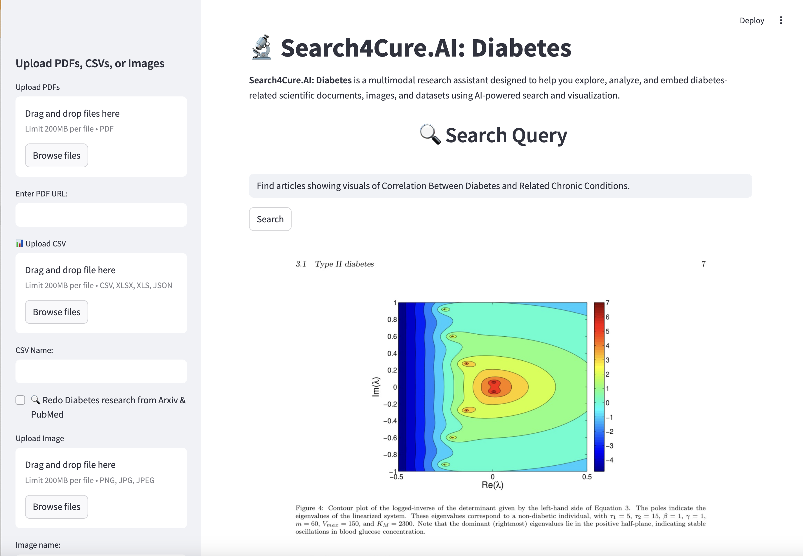

# 🧠 Diabetes Research Assistant
Visit:
https://search4cure-diabetes.streamlit.app/ 

Execution of the demo app:
`streamlit run main.py`

Visit https://github.com/tubakadriye/search4cure-diabetes-deployment repo, for the deployment on Streamlit Cloud. 

**Diabetes Research Assistant** is a Streamlit-based application that leverages LLM agents to help researchers, students, and practitioners discover and explore scientific publications focused on the use of machine learning methods in diabetes prediction, treatment, and care management.

This tool provides:
- Summarized insights from research papers  
- Mentions of core topics or methods  
- Links to related or cited articles  
- A conversational interface to interactively query a corpus of academic papers  

---

## 🚀 Features

- 🔍 **Semantic Search**: Ask natural language questions like “What are recent ML methods used in diabetes care?” and get summarized paper insights.
- 📑 **Detailed Summaries**: Extracts summaries, topic mentions, and reference links from specific pages of papers.
- 🧠 **LLM Agent Integration**: Uses an AI agent (e.g., LangChain with OpenAI) to reason over indexed papers and return relevant context-based results.
- 🖥️ **User-Friendly Interface**: A clean, interactive UI built with [Streamlit](https://streamlit.io).

---

